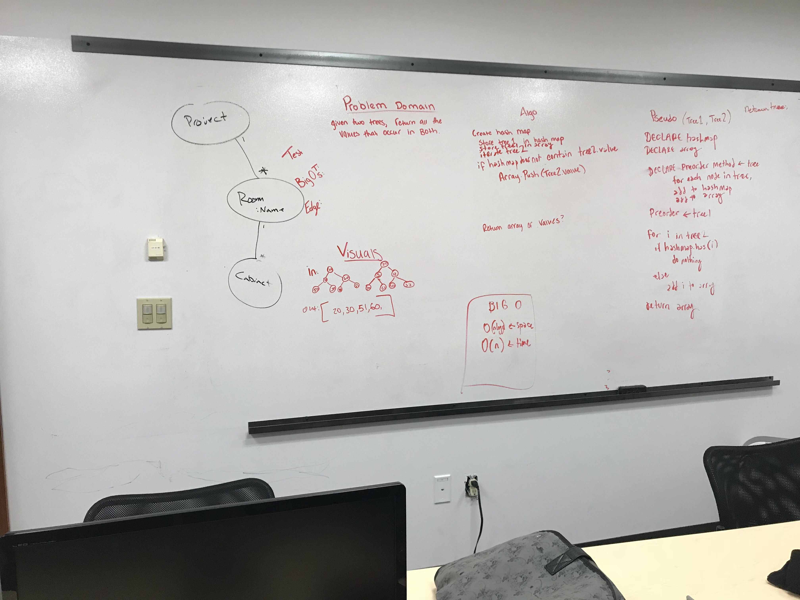

## Challenge
The challenge was to return all of the values that exist in both trees
## Approach & Efficiency
the approach was O(n) O(n) you neeed to traverse through all nodes in each tree at least once

## Solution

